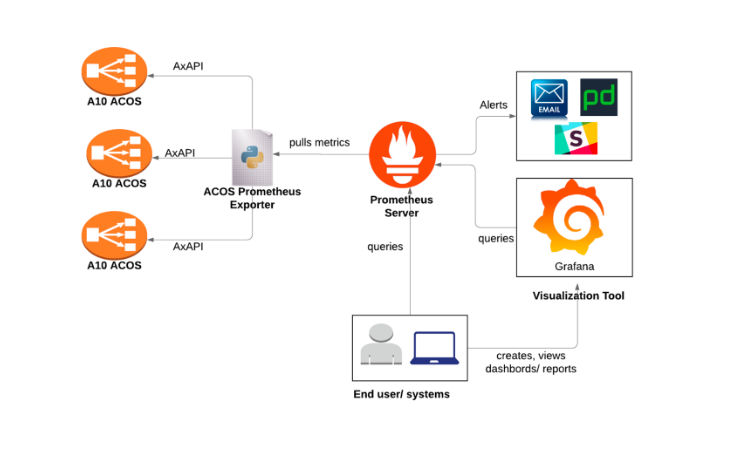

# Prometheus exporter module for ACOS devices:

- The ACOS Prometheus exporter module is responsible for collecting ACOS device stats as metrics. 
- It internally invokes the target ACOS device axAPIs to obtain those statistics and then exposes the respective metrics via HTTP(s) which can be pulled by a Prometheus server. 
- Any visualization client like Grafana can be configured to query the stats from Prometheus server, plot them, set thresholds, configure alerts, create heat maps, generate tables etc. as needed to analyze the ACOS stats.
- The Prometheus server works on a pull-based model and periodically queries the exporter based on interval specified. It runs by default on port 9090. 
- End users/systems can directly communicate with the Prometheus server or create and view dashboards using a visualization/analytics tools like Grafana.
- The exporter can be configured to communicate with multiple ACOS devices in a multi-cloud environment. More details on configuration follows later.
- The exporter supports querying of any stats API as configured in Prometheus server yaml file. Gauge metrics are created for each stats field and are exposed on the port 9734 by the exporter.
More details on server yaml file follows later. 

## Architecture of the Prometheus setup



## Components of the solution

#### 1) Exporter
- Custom exporter is a python script/container which:
- Invokes ACOS axAPIs to fetch the stats fields.
- Exposes the queried stats in the form of Prometheus metrics.
- It follows the principle of URL intercepting. The URLs need to be specified in the Prometheus server’s configuration file. The specified axAPI is invoked as per the url name.
- Exporter creates a Gauge metrics for each stats field and exposes the same on the port 9734

Sample config.json snippet:
```
{
"hosts":{
"{host_ip}": {
		"username": "{username}",
		"password": "{password}"
	}
},
"log":{
"log_file":{log_file_name},
"log_level":"{log_level}"
}
}
```
 - host_ip: ACOS instance IP which is to be monitored
 - log_level: set log level to debug for debugging purposes. Default log_level id set to INFO.
 

#### 2) Prometheus Server
Prometheus server is responsible for monitoring and continuous polling the stats filed that are exposed by the exporter.
It refers to the prometheus.yml configuration file for polling.
Prometheus server runs on port 9090 by default.
It can also send out the alerts to ITSM systems such as PagerDuty, ServiceNow, Slack etc.
   
Sample prometheus.yml config snippet: 

```   
global:
  scrape_interval:     15s
  evaluation_interval: 15s
 
  - job_name: 'prometheus_job_6'
    static_configs:
    - targets: ['localhost:9734']
    metrics_path: '/metrics'    
    params:
        host_ip: ["10.43.12.122"]
        api_endpoint: ["/slb/dns", "/slb/virtual-server/10.10.10.2/port/80+tcp", "/slb/fix"]
        api_name: ["_slb_dns", "_slb_virtual_server_10.10.10.2_port_80_tcp", "_slb_fix"]
	partition: ["P1"]
	
```       
   
- scrape_interval: time interval for querying stats fields
- target: hostname and port that exporter is running on
- api_endpoint: URI endpoint that exporter will intercept and invoke the appropriate axAPI. A comma seperated list of APIs can be provided here for a single host.
- api_name: API name any name used to indentify the API endpoint. Comma seperated list of api_name should be in synch with api_endpoint list
- partition: Name of the partition. This is optional parameter. If not specified, shared partition will be used. 

In this scenario, once Prometheus server is started, it invokes a custom exporter after each 15sec, as specified in the scraping interval.
api_endpoint and api_name (unique identifier for a job) are passed to the exporter as parameters.
Exporter invokes axAPI for port and fetches the stats fields, creates gauge metrics for each stats field and exposes the metrics to Prometheus server.
 
#### 3) Visualization tool:
- Prometheus UI runs on port 9090 by default.
 - It has an in-built visualization functionality that displays the metrics information exposed by the exporter.
- User can select the targets and get the all metrics for an end-point or can search for a specific metric by querying using Prometheus query language expression.
- Same metrics can be visualized ina graphical form by using visualization tools like Grafana.
- A data source needs to be added as Prometheus in order to display metrics in the graphical form in Grafana.
- A metrics can be queried by entering the stats field name in the query box (either in prometheus query page or graphana). eg: "curr_proxy", "total_fwd_bytes" etc.
- Refer [Prometheus Querying](https://prometheus.io/docs/prometheus/latest/querying/basics/) for more information.


## Installation/ setup instructions:

The exporter can be run as a standalone python script, built into a container. 

Running as a standalone script <Sujeet>
```
pip install -r requirements.txt
```

Running as a container

In order to use the exporter as a container, clone the github repo https://github.com/a10networks/PrometheusExporter
 
```
git clone https://github.com/a10networks/PrometheusExporter
```

Currently the container needs to be built locally using following command
 
```
docker build -t <image_name>:<tag> .
```

Run the exporter using the below command. Replace the placeholder <local_path_to_config.json> with local path to config.json
 
 ```
docker run -d -p 9734:9734 -v <local_path_to_config.json>:/app/config.json <image_name>:<tag>
```

To inspect the logs please follow below commands.
 
 ```
docker ps
```

Replace the placeholder <container ID> with the container id from the above command output.
 
 ```
docker exec -it <container-ID> bash
tail -f logs.log
```


